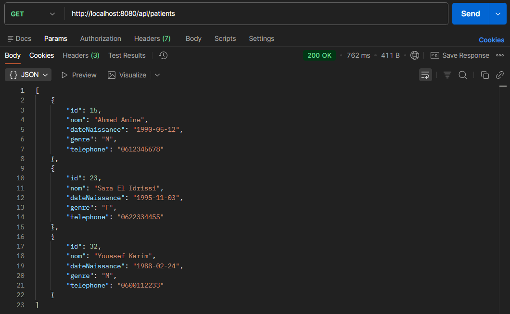
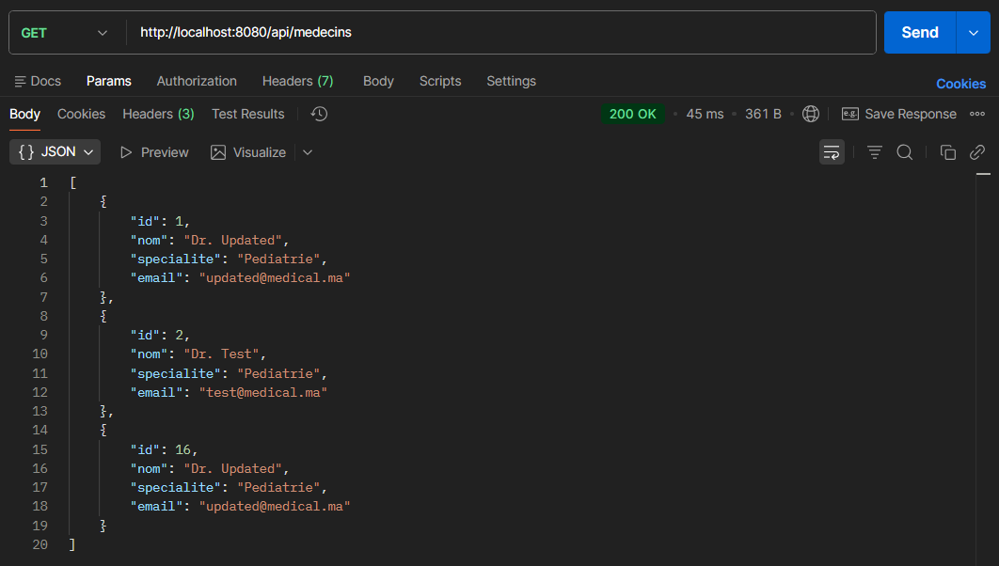
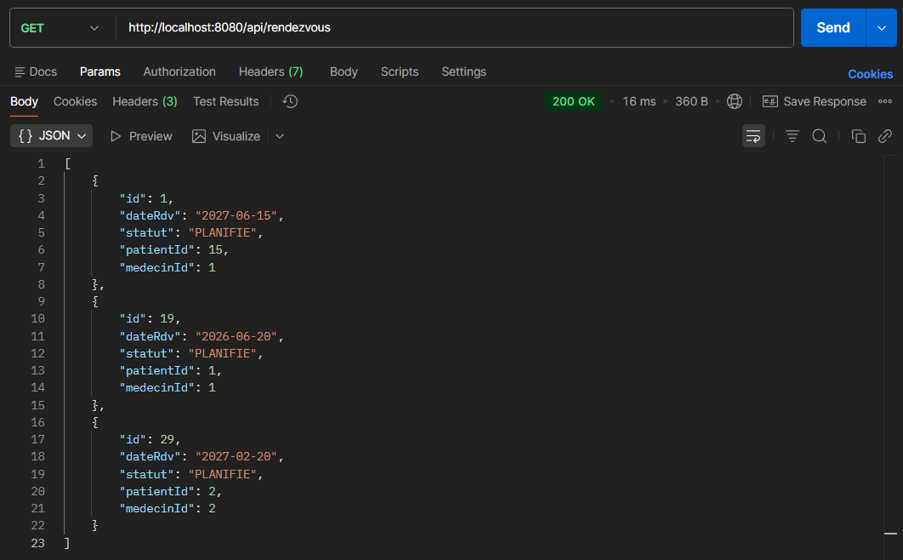
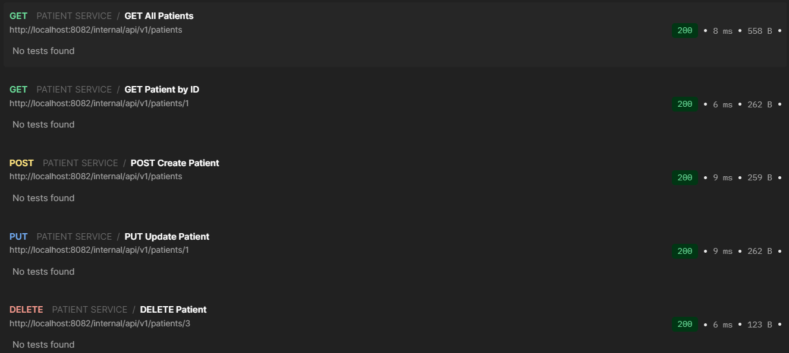
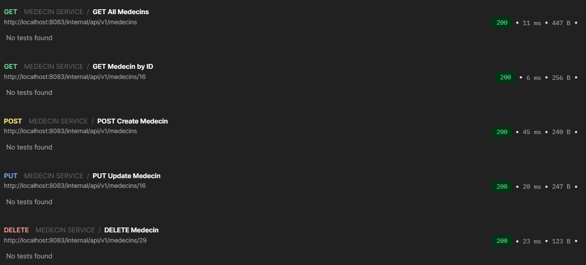
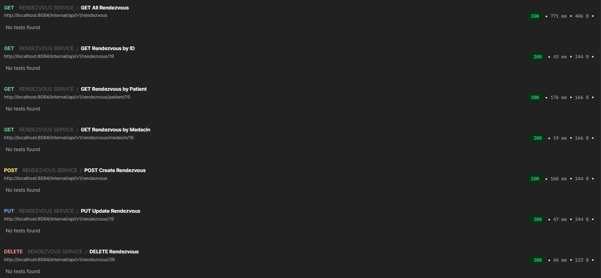
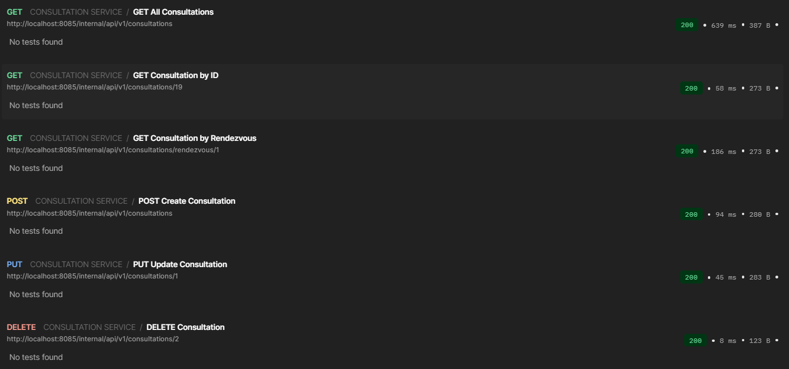
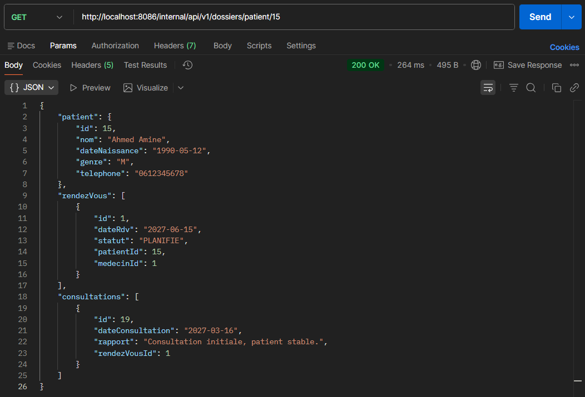

# TP3 – Architecture Microservices (REST)
## Gestion d'un Cabinet Médical

Cours assuré par : **Jaouad OUHSSAINE**  
Contact : jaouad.ouhs@gmail.com | jaouad_ouhssaine@um5.ac.ma

---

## Contexte

Ce TP correspond à la **troisième phase** du projet pédagogique évolutif  
**Gestion d'un Cabinet Médical**.

Il consiste à **faire évoluer l'architecture SOA du TP2** vers une  
**architecture microservices REST**, basée sur des microservices **totalement autonomes**, chacun disposant de sa **propre API** et de sa **propre base de données**, avec un **API Gateway** comme point d'entrée unique.

---

## Objectifs du TP

- Mettre en place une architecture **microservices**
- Découpler totalement les services (code et données)
- Supprimer tout module de persistance partagé
- Introduire un **API Gateway** pour l'exposition des APIs
- Mettre en œuvre la communication **REST inter-services**
- Comprendre la différence entre **SOA et Microservices**

---

## Architecture globale

L'architecture est basée sur :
- Des **microservices métiers autonomes** (Patient, Médecin, Rendez-vous, Consultation)
- Un **service composite** pour l'agrégation des données (Dossier Patient)
- Un **API Gateway** servant de point d'entrée unique pour les clients externes
- Une **base de données par microservice**

Les clients n'accèdent jamais directement aux microservices, toutes les requêtes passent par le Gateway.

---

## Structure du projet

```text
cabinetMedicalTp3MS/
│
├── api-gateway                  # API Gateway (point d'entrée externe)
│
├── patient-service              # Microservice Patient (API + DB)
├── medecin-service              # Microservice Médecin (API + DB)
├── rendezvous-service           # Microservice Rendez-vous (API + DB)
├── consultation-service         # Microservice Consultation (API + DB)
│
├── dossier-service              # Service composite (agrégation REST)
│
└── pom.xml                      # Projet parent (packaging pom)

```

---

## Configuration des Services

| Service | Port | Base de données |
|---------|------|----------------|
| API Gateway | 8080 | - |
| Patient Service | 8082 | H2 (patientDB) |
| Médecin Service | 8083 | H2 (medecinDB) |
| Rendez-vous Service | 8084 | H2 (rendezvousDB) |
| Consultation Service | 8085 | H2 (consultationDB) |
| Dossier Service | 8086 | - (Service composite) |

---

## Liste des Endpoints REST

### 1. API Gateway (Port 8080)

L'API Gateway expose les endpoints suivants aux clients externes :

#### Patient Service (via Gateway)
- `GET /api/patients` - Récupérer tous les patients
- `GET /api/patients/{id}` - Récupérer un patient par ID
- `POST /api/patients` - Créer un nouveau patient
- `PUT /api/patients/{id}` - Mettre à jour un patient
- `DELETE /api/patients/{id}` - Supprimer un patient

#### Médecin Service (via Gateway)
- `GET /api/medecins` - Récupérer tous les médecins
- `GET /api/medecins/{id}` - Récupérer un médecin par ID
- `POST /api/medecins` - Créer un nouveau médecin
- `PUT /api/medecins/{id}` - Mettre à jour un médecin
- `DELETE /api/medecins/{id}` - Supprimer un médecin

#### Rendez-vous Service (via Gateway)
- `GET /api/rendezvous` - Récupérer tous les rendez-vous
- `GET /api/rendezvous/{id}` - Récupérer un rendez-vous par ID
- `GET /api/rendezvous/patient/{id}` - Récupérer les rendez-vous d'un patient
- `GET /api/rendezvous/medecin/{id}` - Récupérer les rendez-vous d'un médecin
- `POST /api/rendezvous` - Créer un nouveau rendez-vous
- `PUT /api/rendezvous/{id}` - Mettre à jour un rendez-vous
- `PATCH /api/rendezvous/{id}/statut` - Mettre à jour le statut d'un rendez-vous
- `DELETE /api/rendezvous/{id}` - Supprimer un rendez-vous

---

### 2. Patient Service - Endpoints Internes (Port 8082)

**Base URL:** `http://localhost:8082/internal/api/v1/patients`

| Méthode | Endpoint | Description |
|---------|----------|-------------|
| GET | `/` | Récupérer tous les patients |
| GET | `/{id}` | Récupérer un patient par ID |
| POST | `/` | Créer un nouveau patient |
| PUT | `/{id}` | Mettre à jour un patient |
| DELETE | `/{id}` | Supprimer un patient |

---

### 3. Médecin Service - Endpoints Internes (Port 8083)

**Base URL:** `http://localhost:8083/internal/api/v1/medecins`

| Méthode | Endpoint | Description |
|---------|----------|-------------|
| GET | `/` | Récupérer tous les médecins |
| GET | `/{id}` | Récupérer un médecin par ID |
| POST | `/` | Créer un nouveau médecin |
| PUT | `/{id}` | Mettre à jour un médecin |
| DELETE | `/{id}` | Supprimer un médecin |

---

### 4. Rendez-vous Service - Endpoints Internes (Port 8084)

**Base URL:** `http://localhost:8084/internal/api/v1/rendezvous`

| Méthode | Endpoint | Description |
|---------|----------|-------------|
| GET | `/` | Récupérer tous les rendez-vous |
| GET | `/{id}` | Récupérer un rendez-vous par ID |
| GET | `/patient/{id}` | Récupérer les rendez-vous d'un patient |
| GET | `/medecin/{id}` | Récupérer les rendez-vous d'un médecin |
| POST | `/` | Créer un nouveau rendez-vous |
| PUT | `/{id}` | Mettre à jour un rendez-vous |
| PATCH | `/{id}/statut` | Mettre à jour le statut d'un rendez-vous |
| DELETE | `/{id}` | Supprimer un rendez-vous |

**Statuts possibles:** PLANIFIE, CONFIRME, ANNULE, TERMINE

---

### 5. Consultation Service - Endpoints Internes (Port 8085)

**Base URL:** `http://localhost:8085/internal/api/v1/consultations`

| Méthode | Endpoint | Description |
|---------|----------|-------------|
| GET | `/` | Récupérer toutes les consultations |
| GET | `/{id}` | Récupérer une consultation par ID |
| GET | `/rendezvous/{id}` | Récupérer une consultation par ID de rendez-vous |
| POST | `/` | Créer une nouvelle consultation |
| PUT | `/{id}` | Mettre à jour une consultation |
| DELETE | `/{id}` | Supprimer une consultation |

---

### 6. Dossier Service - Endpoints Internes (Port 8086)

**Base URL:** `http://localhost:8086/internal/api/v1/dossiers`

| Méthode | Endpoint | Description |
|---------|----------|-------------|
| GET | `/patient/{patientId}` | Récupérer le dossier complet d'un patient (agrégation) |

**Note:** Ce service composite agrège les données de Patient, Rendez-vous et Consultation pour fournir une vue complète du dossier patient.

---

## Captures d'écran des Tests

### Tests via API Gateway

#### 1. GET Patients (via Gateway)


**Endpoint testé:** `GET http://localhost:8080/api/patients`

---

#### 2. GET Médecins (via Gateway)


**Endpoint testé:** `GET http://localhost:8080/api/medecins`

---

#### 3. GET Rendez-vous (via Gateway)


**Endpoint testé:** `GET http://localhost:8080/api/rendezvous`

---

### Tests des APIs Internes

#### 4. Patient Service - Endpoints Internes


**Endpoint testé:** `http://localhost:8082/internal/api/v1/patients`

---

#### 5. Médecin Service - Endpoints Internes


**Endpoint testé:** `http://localhost:8083/internal/api/v1/medecins`

---

#### 6. Rendez-vous Service - Endpoints Internes


**Endpoint testé:** `http://localhost:8084/internal/api/v1/rendezvous`

---

#### 7. Consultation Service - Endpoints Internes


**Endpoint testé:** `http://localhost:8085/internal/api/v1/consultations`

---

#### 8. Dossier Service - Endpoints Internes (Agrégation)


**Endpoint testé:** `http://localhost:8086/internal/api/v1/dossiers/patient/{patientId}`

---

## Communication Inter-Services

Le projet implémente la communication REST entre microservices :

- **Rendez-vous Service** → Patient Service & Médecin Service
  - Validation de l'existence du patient et du médecin lors de la création d'un rendez-vous
  
- **Consultation Service** → Rendez-vous Service
  - Validation de l'existence du rendez-vous lors de la création d'une consultation
  
- **Dossier Service** → Patient Service, Rendez-vous Service & Consultation Service
  - Agrégation des données pour constituer le dossier complet du patient

---

## Démarrage du Projet

1. **Compiler le projet parent:**
   ```bash
   mvn clean install
   ```

2. **Démarrer les services dans l'ordre suivant:**
   - Patient Service (8082)
   - Médecin Service (8083)
   - Rendez-vous Service (8084)
   - Consultation Service (8085)
   - Dossier Service (8086)
   - API Gateway (8080)

3. **Accéder aux services:**
   - API Gateway: `http://localhost:8080`
   - Consoles H2:
     - Patient: `http://localhost:8082/h2-console`
     - Médecin: `http://localhost:8083/h2-console`
     - Rendez-vous: `http://localhost:8084/h2-console`
     - Consultation: `http://localhost:8085/h2-console`

---

## Technologies Utilisées

- **Spring Boot** - Framework principal
- **Spring Cloud Gateway** - API Gateway
- **Spring Data JPA** - Persistence des données
- **H2 Database** - Base de données en mémoire
- **RestTemplate** - Communication inter-services
- **Lombok** - Réduction du code boilerplate
- **Maven** - Gestion des dépendances

---

## Auteur

Projet réalisé dans le cadre du **TP3 - Architecture Microservices**  
Cours assuré par : **Jaouad OUHSSAINE**

